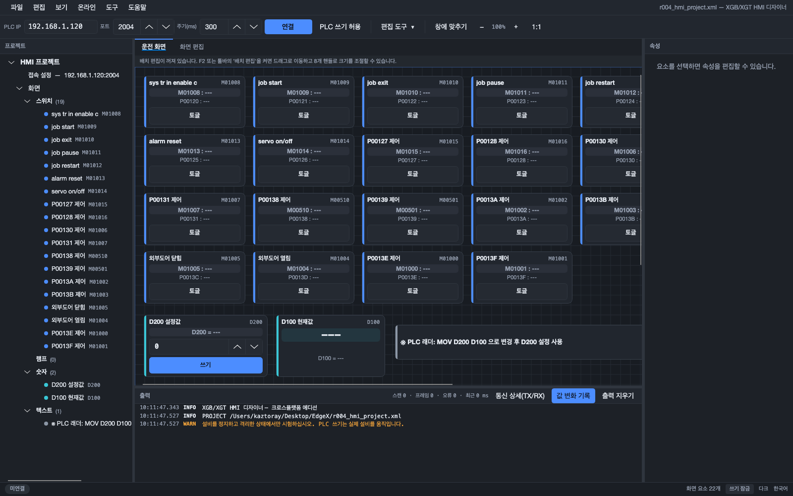
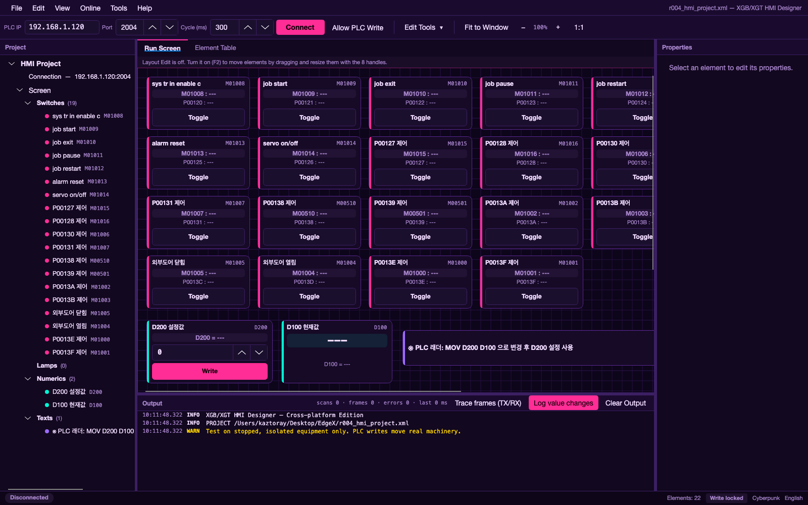
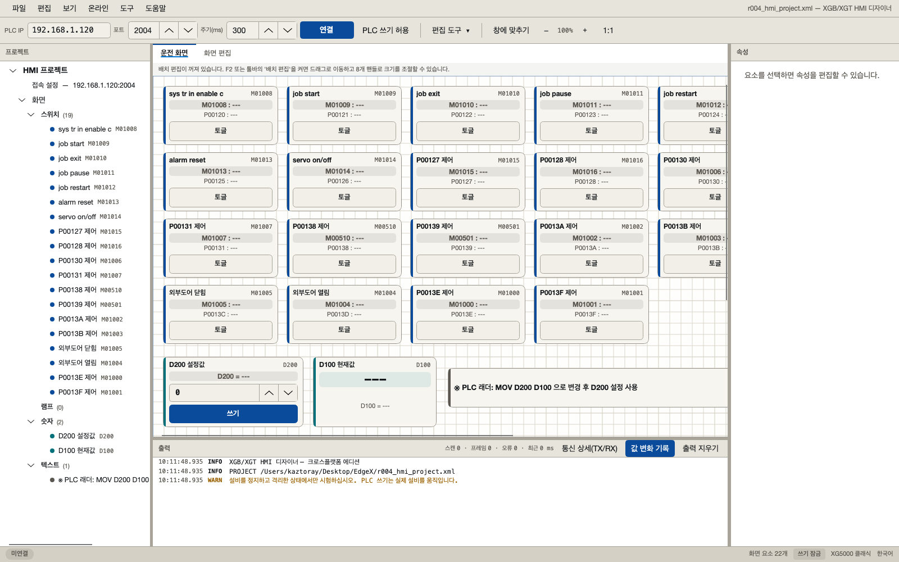
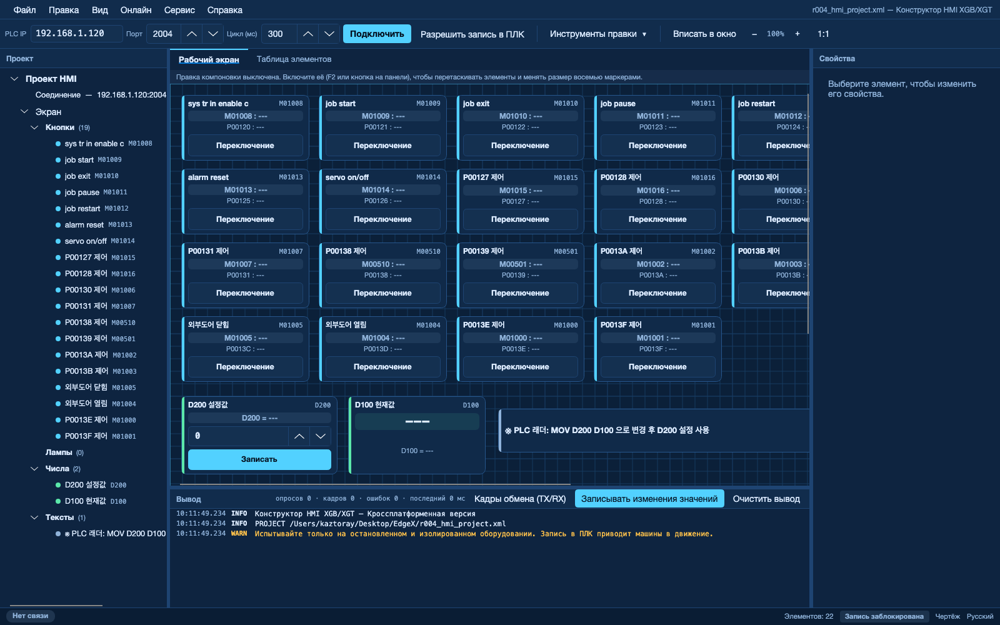
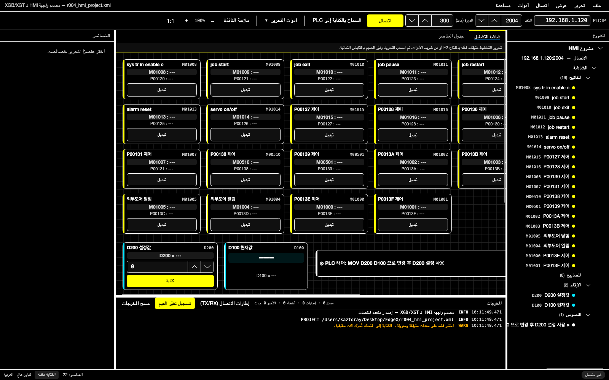

# XGB/XGT HMI Designer — 크로스플랫폼 에디션

LS ELECTRIC **XGB(MK) / XGT FEnet** PLC용 HMI 디자이너 겸 운전 화면입니다.
기존 Windows 전용 C#/WinForms v6 판을 **F# + Avalonia**로 다시 만들어 **Windows / macOS / Linux**에서 같은 실행 파일 구조로 동작합니다.

* 통신 동작(프레임 바이트, 토글 절차, M비트 Read‑Modify‑Write)은 v6와 **동일**합니다.
* 프로젝트 파일(`r004_hmi_project.xml`)은 v6와 **완전히 호환**됩니다. 서로 열고 저장할 수 있습니다.
* UI는 XG5000 / XP Builder / GT Designer / GX Works 계열 엔지니어링 툴 배치로 전면 재작업했습니다.
* 테마 6종, 언어 20종(한국어·영어·일본어 포함)을 지원합니다.



---

## 1. 실행

.NET 10 SDK만 있으면 됩니다. ([다운로드](https://dotnet.microsoft.com/download))

| OS | 실행 |
|---|---|
| macOS / Linux | `./run.sh` |
| Windows | `run.cmd` |
| 공통 | `dotnet run --project src/XgbHmi.App -c Release` |

### 배포용 단일 실행 파일

대상 PC에 .NET을 설치하지 않아도 되는 형태로 묶습니다.

```bash
./publish.sh              # 현재 OS
./publish.sh win-x64      # 윈도우 64비트
./publish.sh linux-x64
./publish.sh osx-arm64
```
```cmd
publish.cmd win-x64
```

결과물은 `dist/<런타임>/XgbHmiDesigner(.exe)` 에 생깁니다.

### 프로젝트 파일 위치

시작할 때 아래 순서로 `r004_hmi_project.xml` 을 찾습니다.

1. 환경변수 `XGBHMI_PROJECT` 에 지정한 경로
2. 현재 작업 폴더
3. 실행 파일 폴더
4. 사용자 데이터 폴더
   * Windows `%AppData%\XgbHmiDesigner`
   * macOS `~/Library/Application Support/XgbHmiDesigner`
   * Linux `~/.config/XgbHmiDesigner`

테마·언어·창 크기 같은 UI 설정은 위 사용자 데이터 폴더의 `settings.json` 에 따로 저장되며 프로젝트 XML을 건드리지 않습니다.

---

## 2. 화면 구성

XG5000 계열 도킹 배치를 따릅니다.

```
┌ 메뉴 (파일 / 편집 / 보기 / 온라인 / 도구 / 도움말) ───────────────────────┐
├ 툴바 (접속 · 편집 도구 ▾ · 배율) ────────────────────────────────────────┤
│ 프로젝트 트리 │ 문서 탭 [운전 화면 | 화면 편집]            │ 속성       │
│ (요소 목록)   ├──────────────────────────────────────────┤ (선택 요소 │
│               │ 출력 창 (통신 로그)                        │  전체 편집)│
├ 상태 표시줄 (연결 상태 · 헤더 프로필 · 요소 수 · 쓰기 잠금 · 테마 · 언어) ┤
└──────────────────────────────────────────────────────────────────────────┘
```

* **프로젝트 트리** — 스위치/램프/숫자/텍스트로 묶어 보여줍니다. 항목을 고르면 캔버스와 표, 속성 창이 함께 선택됩니다.
* **운전 화면** — 카드형 HMI. 상태는 색으로 표시되고, ON 인 요소는 모든 테마에서 발광합니다(아래 *라이팅* 참조).
  도면(작화 영역)이 테두리로 표시되고 그 안팎을 자유롭게 스크롤합니다. 도면 크기는 `편집 도구 ▾` 의 `화면 크기` 로 바꿉니다(기본 1600×1000).
* **화면 편집(표)** — 여러 행 선택, 셀 직접 편집. v6의 DataGridView 편집 기능을 그대로 옮겼습니다.
  `형식` 과 `스위치 동작` 은 칸을 눌러 목록에서 고릅니다.
* **속성 창** — 선택한 요소의 모든 값을 편집합니다. 종류에 따라 필요 없는 칸은 자동으로 숨겨집니다.
* **출력 창** — 통신 로그. `시각 · 등급(INFO/OK/WARN/ERR/TRC) · 내용` 3단으로 보여 줍니다. 자세한 내용은 아래 참조.

### 툴바

운전 중에 늘 쓰는 것만 밖에 두고, 화면을 고칠 때 쓰는 것은 **`편집 도구 ▾`** 버튼 하나에 모았습니다.

```
PLC IP [ ] 포트 [ ] 주기 [ ] [연결] [PLC 쓰기 허용] │ [편집 도구 ▾] │ [창에 맞추기] − 100% ＋ 1:1
```

`편집 도구 ▾` 안에 들어 있는 것:

| 묶음 | 항목 |
|---|---|
| 추가 | 요소 추가 ▸ (6종) · 스위치 수량 추가 |
| 보기 | ☑ 배치 편집 · ☑ 격자 표시 · ☑ 격자에 맞추기 |
| 되돌리기 | 실행 취소 · 다시 실행 |
| 편집 | 복사 · 붙여넣기 · 선택 복제 ×N · 삭제 |
| 배치 | 정렬 ▸ (6종) · 화면 크기 [폭] × [높이] |
| 반영 | 화면 적용 |

단축키(F2, Ctrl+Z/Y/C/V, Delete 등)는 메뉴를 열지 않아도 그대로 듣습니다.

### 요소 종류 (형식)

툴바 **`편집 도구 ▾` → `요소 추가`** 에서 고릅니다. 메뉴바의 `편집` 메뉴에도 같은 항목이 있습니다.

| 형식 | 주소 | 내용 |
|---|---|---|
| 스위치 | M / P 비트 | 조작 버튼. 상태는 위쪽 알약에 글자로 나옵니다. |
| 램프 | M / P 비트 | 표시 전용. 원과 배경으로 상태를 보여 줍니다. |
| **스위치/램프** | M / P 비트 | 위는 램프, 아래는 조작 버튼. **한 장에서 누르고 결과를 함께 봅니다.** |
| 숫자입력 | D WORD | 값을 입력해 쓰기 |
| 숫자표시 | D WORD | 값 표시 전용 |
| 텍스트 | — | 안내 문구 |

`스위치/램프` 의 램프는 **상태확인 디바이스**가 있으면 그 값을, 없으면 디바이스 값을 보여 줍니다.
즉 명령한 비트가 아니라 설비가 실제로 돌아왔는지를 램프로 확인하면서 조작할 수 있습니다.

### 스위치 동작

`스위치` 와 `스위치/램프` 에만 있습니다.

| 동작 | 누르면 |
|---|---|
| 토글 | 그 순간 PLC의 실제 비트를 읽어 반전합니다. (화면 캐시를 쓰지 않음) |
| ON | 비트를 ON 으로 씁니다. |
| OFF | 비트를 OFF 로 씁니다. |
| 순간 | 누르는 동안 ON, 떼면 OFF. |

> v6 에 있던 `ON/OFF`(ON·OFF 버튼 두 개짜리)는 없앴습니다. 예전 프로젝트 파일에 `ON/OFF` 가 들어 있으면
> **토글**로 읽습니다. 파일은 그대로 열리고 저장됩니다.

### 라이팅 (동작 표시 / 오류 점등)

운전 중인 상태를 실제 조작반처럼 램프로 보여 줍니다.

| 상태 | 표시 |
|---|---|
| 스위치 ON | 조작 버튼이 초록색(`On`)으로 점등됩니다. |
| 스위치 OFF | 동작이 `OFF` 인 버튼은 비트가 OFF 일 때 회색(`Off`)으로 점등되어 지금 상태를 알려 줍니다. |
| 순간 스위치 | 누르고 있는 동안 바로 점등되고, 떼면 다음 스캔값으로 되돌아갑니다. |
| 램프 ON | 원과 배경이 초록색으로 켜지고 발광합니다. |
| 스위치/램프 | 위쪽 램프와 아래쪽 버튼이 함께 켜집니다. |
| **오류** | 카드 전체가 **빨간색**으로 점등됩니다. 바탕·색 띠·상태 알약·조작 버튼이 모두 빨개지고, 카드에 마우스를 올리면 오류 내용이 나옵니다. |

오류로 점등되는 경우는 두 가지입니다.

* **요소별 오류** — 그 요소의 비트/WORD 쓰기나 토글 읽기가 실패했을 때. 해당 카드만 빨개지고, 다음 성공한 조작에서 꺼집니다.
* **통신 오류** — 스캔이 끊기거나 연결에 실패했을 때. 운전 화면의 **모든** 카드가 빨개지고, 다시 연결하면 꺼집니다.

상태확인 디바이스(`MonitorDevice`)를 지정한 스위치는 그 값을 우선해서 점등합니다. 즉 명령한 비트가 아니라 설비가 실제로 돌아왔는지를 보여 줍니다.

### 배치 편집 (v3 Pro-face 식 조작 유지)

`배치 편집` 을 켜면(툴바 또는 **F2**)

* 카드를 아무 곳이나 잡고 끌어 이동
* 선택한 카드의 **8개 핸들**(모서리 4 + 변 4)로 크기 조절
* 이동/크기조절 중 상태 표시줄에 `X / Y / W / H` 실시간 표시
* 카드 우클릭 → 복사 / 복제 / 삭제, 빈 곳 우클릭 → 여기에 붙여넣기
* 배치 편집 중에는 **PLC로 어떤 명령도 보내지 않습니다** (v6와 동일한 안전 규칙)
* 격자 표시 / 격자에 맞추기(10px 스냅) / 배율(40~300%)은 새로 추가된 편의 기능입니다.

> 이동·크기조절은 **배치 편집이 켜져 있을 때만** 됩니다(PLC 오조작 방지). 켜졌는지는 `편집 도구 ▾` 의 체크 표시와 운전 화면 위 안내줄로 확인합니다.

### 자동 정렬 (편집 → 정렬, `편집 도구 ▾` → 정렬)

| 명령 | 동작 |
|---|---|
| 자동 배치 | 선택한 요소(선택이 없으면 화면 전체)를 캔버스 폭에 맞춰 격자로 다시 깔아 겹침을 없앱니다. 원래 읽는 순서(위→아래, 왼쪽→오른쪽)는 유지합니다. |
| 왼쪽 / 가로 가운데 / 오른쪽 맞춤 | 선택한 2개 이상을 세로 기준선에 맞춥니다. |
| 위 / 세로 가운데 / 아래 맞춤 | 선택한 2개 이상을 가로 기준선에 맞춥니다. |
| 가로·세로 간격 균등 | 선택한 3개 이상의 간격을 고르게 만듭니다. 양 끝 요소는 움직이지 않습니다. |
| 크기 맞춤 | 마지막에 고른 요소의 폭·높이에 나머지를 맞춥니다. |

정렬 결과는 표·속성 창·트리에 즉시 반영되며, `저장`을 눌러야 XML에 남습니다.

### 넓은 화면에 많이 배치하기

* **도면 크기** — `편집 도구 ▾` 의 `화면 크기 [폭] × [높이]` (640×480 ~ 20000×20000). 프로젝트 XML에 `ScreenWidth` / `ScreenHeight` 로 저장되며, 이 항목이 없는 v6 파일은 기본값 1600×1000으로 열립니다.
* **자동 확장** — 요소를 도면 밖으로 끌어다 놓으면 도면이 그만큼 자동으로 넓어집니다. 저장할 때도 요소를 모두 담도록 맞춰집니다.
* **스크롤** — 휠(세로) / `Shift`+휠(가로) / 스크롤바. 배치 편집 중 화면 가장자리로 끌면 저절로 스크롤됩니다.
* **배율** — `Ctrl`(⌘)+휠, 툴바 `−` `+` `1:1`, 그리고 `창에 맞추기` (도면 전체를 한눈에).
* **영역 선택** — 배치 편집에서 빈 곳을 드래그하면 사각형 안의 요소가 한 번에 선택됩니다. 선택 후 정렬 명령과 함께 쓰면 편합니다.
* **미세 이동** — 배치 편집에서 방향키 1px, `Shift`+방향키 10px.
* **실행 취소 / 다시 실행** — `Ctrl+Z` / `Ctrl+Y`(또는 `Ctrl+Shift+Z`). 추가·삭제·붙여넣기·정렬·드래그·속성 수정까지 되돌립니다(최근 60단계).

### 단축키

| 키 | 기능 |
|---|---|
| Ctrl+C / Ctrl+V | 선택 요소 복사 / 붙여넣기(20px씩 어긋나게) |
| Ctrl+A | 모두 선택 |
| Delete | 선택 삭제 |
| Ctrl+Z / Ctrl+Y | 실행 취소 / 다시 실행 |
| Ctrl+D | 선택 요소 1개 복제 |
| 방향키 / Shift+방향키 | 선택 요소 1px / 10px 이동 (배치 편집 중) |
| Ctrl+S / Ctrl+O | 저장 / 열기 |
| F5 | 연결 / 연결 해제 |
| F2 | 배치 편집 켜기·끄기 |

### 출력 창에 남는 정보

기본으로 남는 것

* 연결: 시도한 헤더 조합 8종을 하나씩 `OK / FAIL` + 회사코드·CPU·슬롯·BCC·소요 시간까지 기록
* 쓰기: `BIT WRITE M01008 (%MX1608) <- ON  READBACK=ON  38 ms  [job start]` 처럼 **주소 · XGT 직접변수 · 요청값 · 되읽은 값 · 소요 시간 · 요소 이름**
* 토글: 클릭 순간 읽은 실제 값과 쓸 값을 함께 표시
* WORD 쓰기: 10진·16진·부호 있는 값과 되읽기 결과
* 오류: 예외 종류 + 원문 메시지 + 걸린 시간
* 상태 표시줄: 마지막 스캔 시각, 읽은 비트/WORD 개수, 스캔 소요 시간

출력 창 머리글의 스위치 두 개로 더 자세히 볼 수 있습니다.

| 스위치 | 내용 |
|---|---|
| **값 변화 기록** (기본 켜짐) | 폴링 중 값이 바뀐 것만 기록. `CHANGE M01008 : OFF -> ON`, `CHANGE D100 : 0 -> 1234 (0x04D2, signed 1234)` |
| **통신 상세(TX/RX)** (기본 꺼짐) | 실제 프레임을 그대로 기록. 보낸 요약과 바이트, 받은 응답의 `cmd`/`status`/길이/응답 시간, M비트 Read‑Modify‑Write 의 매 시도(`RMW #1: %MW100 0x00FF -> 0x01FF`)와 되읽기 결과, 스캔 주기 요약(`SCAN #12 비트 21개(프레임 2) · WORD 2개 → 18.4 ms`) |

머리글 오른쪽에는 `스캔 n · 프레임 n · 오류 n · 최근 n ms` 통계가 계속 갱신됩니다.

---

## 3. 테마와 언어

**테마 6종** (보기 → 테마) — 라이트, 다크, 사이버펑크, XG5000 클래식, 블루프린트, 고대비

| 사이버펑크 | XG5000 클래식 |
|---|---|
|  |  |

| 블루프린트 | 고대비 (아랍어 RTL) |
|---|---|
|  |  |

**언어 20종** (보기 → 언어)

한국어 · English · 日本語 · 简体中文 · 繁體中文 · Deutsch · Français · Español · Português · Italiano ·
Русский · Polski · Nederlands · Čeština · Türkçe · Tiếng Việt · ไทย · Bahasa Indonesia · हिन्दी · العربية

* 처음 실행할 때 OS 표시 언어를 자동으로 고르고, 지원하지 않으면 영어로 시작합니다.
* 아랍어에서는 화면 전체가 오른쪽→왼쪽으로 뒤집힙니다. 단, 도면 좌표를 지키기 위해 **캔버스는 항상 왼쪽→오른쪽**을 유지합니다.
* 번역 문자열은 `src/XgbHmi.Core/Assets/lang/<코드>.json` 에 있고 어셈블리에 포함되어 배포됩니다.
  언어를 추가하려면 파일을 하나 더 넣고 `I18n.languages` 에 한 줄 추가하면 됩니다.
* PLC 통신 예외 메시지는 현장 대조를 위해 v6와 동일한 한국어 원문을 그대로 유지합니다.

---

## 4. PLC 연결과 안전

1. 툴바에 PLC IP / 포트(기본 2004) / 주기(ms)를 입력하고 **연결**.
2. 연결 시 XGT 헤더 조합 8가지(LSIS-XGT·LGIS-GLOFA × Slot0/1 × BCC 사용/미사용)를 순서대로 자동 시험하고,
   성공한 조합을 상태 표시줄 `헤더 프로필` 에 표시합니다. 실패 내역은 출력 창에 남습니다.
3. 쓰기는 **`PLC 쓰기 허용`** 을 켜고 확인 대화상자에 동의해야만 열립니다. 상태 표시줄에 빨간 `쓰기 허용됨` 배지가 뜹니다.
4. 연결을 끊으면 쓰기 허용은 자동으로 잠깁니다.

> ⚠ 실제 설비가 움직입니다. 설비를 **정지·격리한 상태**에서만 시험하십시오.

### 주소 표기 (v6 규칙 그대로)

| 표기 | 뜻 | XGT 직접변수 |
|---|---|---|
| `M01008` | MW100 의 bit 8 | `%MX1608` |
| `M0100F` | MW100 의 bit F(15) | `%MX1615` |
| `P00120` | PW12 의 bit 0 | `%PX192` |
| `D200` | D 영역 WORD 200 | `%DW200` |

* 중간 자리는 **10진수 WORD**, 마지막 한 자리는 **16진수 BIT** 입니다.
* **M 비트 쓰기**는 `%MX` 개별 비트 쓰기가 아니라 해당 `%MW` 를 읽어 그 비트만 바꿔 되쓰는 방식(Read‑Modify‑Write)이며, 최대 3회까지 실제 비트를 다시 확인합니다. (v5/v6 TOGGLE FIX)
* **토글**은 클릭한 순간 PLC의 실제 비트를 읽고 반전합니다. 화면 캐시를 쓰지 않습니다. (v4 수정)
* 쓰기 후 30ms 뒤 되읽어 요청값과 다르면 출력 창에 `WARNING ... ladder may be overwriting this bit` 경고를 남깁니다.
* 한 프레임에서 최대 16 WORD를 읽습니다. 비트 주소는 WORD 단위로 자동으로 묶입니다.

---

## 5. 소스 구성

```
src/
  XgbHmi.Core/        도메인 모델, 프로젝트 XML 입출력, 20개 언어 카탈로그
    Model.fs          HmiItem / HmiProject / 검사 규칙 / r004 기본 예제 / 도면 크기
    Layout.fs         자동 배치·맞춤·간격 균등·크기 맞춤 (순수 계산)
    I18n.fs           언어 목록·조회·OS 언어 감지
    ProjectIo.fs      v6 호환 XML 읽기·쓰기, 프로젝트 경로 결정
    Assets/lang/*.json
  XgbHmi.Protocol/    PLC 통신 (UI 의존 없음)
    Address.fs        XG5000 표기 해석 (10진 WORD + 16진 BIT)
    XgtClient.fs      XGT FEnet TCP 클라이언트
  XgbHmi.App/         Avalonia 데스크톱 앱
    Themes/           팔레트 6종 + 컨트롤 스타일(Controls.axaml)
    Services/         테마 적용, 설정 저장, PLC 연결/폴링 서비스
    ViewModels/       요소 편집 모델(ElementVm), 프로젝트 상태(AppState)
    Views/            메인 창, 캔버스, 표, 트리, 속성, 출력, 대화상자
tests/XgbHmi.Tests/   가짜 XGT 서버로 프레임까지 검증하는 테스트 52개
tools/                번역 파일 생성기, 스크린샷 생성 도구
legacy/               기존 Windows 전용 C#/WinForms v6 소스와 이력 문서 (참고용 보관)
```

### 빌드와 테스트

```bash
dotnet build XgbHmiDesigner.slnx
dotnet test tests/XgbHmi.Tests
```

테스트는 실제 XGB처럼 응답하는 가짜 TCP 서버를 띄워
연결 시험 프레임, M비트 Read‑Modify‑Write, `%PX` 개별 비트 쓰기, WORD 리틀엔디안 인코딩,
16 WORD 상한, v6 XML 읽기/쓰기 호환성을 바이트 단위로 확인하고,
정렬 계산(겹침 없음·순서 유지·간격 균등)과 출력 창 기록(값 변화, TX/RX 추적, 스캔 요약)까지 함께 검사합니다.

`src/XgbHmi.Core/Layout.fs` 의 정렬 계산은 순수 함수라 화면 없이도 그대로 시험할 수 있고,
`tools/ShotHarness` 는 창을 헤드리스로 렌더해 PNG 로 저장하거나(`--drag` 옵션) 마우스 입력을 흘려
드래그 이동이 실제로 되는지 확인합니다.

---

## 6. v6(WinForms)에서 달라진 점

기능은 모두 유지했고, 다음이 추가·개선되었습니다.

| 구분 | v6 | 이번 판 |
|---|---|---|
| 언어 | F# / Avalonia 대신 C# / WinForms | **F# / Avalonia (.NET 10)** |
| OS | Windows 전용 (mac은 Wine 필요) | **Windows / macOS / Linux 네이티브** |
| 화면 | 탭 3개 | 메뉴 + 툴바 + 프로젝트 트리 + 문서 탭 + 속성 창 + 출력 창 + 상태 표시줄 |
| 편집 | 표에서 고치고 `화면 적용` 필요 | 표·속성창·캔버스가 즉시 연동 (`화면 적용`은 검사용으로 유지) |
| 테마 | 없음 | 6종 |
| 언어 | 한국어 | 20종 |
| 로그 | 단색 텍스트 | 등급 태그 + 색 구분 |
| 캔버스 | 고정 배율 · 내용만큼만 | 도면 크기 지정(기본 1600×1000, 자동 확장) · 스크롤 · 격자 · 스냅 · 40~300% 배율 · 창에 맞추기 |
| 선택 | 카드 1개씩 | 영역(고무줄) 선택 · Ctrl 다중 선택 · 표에서 다중 선택 |
| 되돌리기 | 없음 | 실행 취소 / 다시 실행 60단계 |
| 정렬 | 수동 좌표 입력 | 자동 배치 + 맞춤/균등/크기 맞춤 |
| 로그 정보 | 결과 한 줄 | 직접변수·요청/되읽기·소요 시간, 값 변화, TX/RX 프레임 원문, 통계 |
| 요소 종류 | 스위치 · 램프 · 숫자입력 · 숫자표시 · 텍스트 | **스위치/램프** 추가 (누르는 버튼과 상태 램프를 한 장에) |
| 스위치 동작 | 토글 · ON · OFF · 순간 · ON/OFF | ON/OFF 를 없앤 4종. 예전 파일의 `ON/OFF` 는 토글로 읽음 |
| 상태 표시 | 글자와 색 | 동작 중인 버튼·램프 점등, 오류는 빨간색 점등 |
| 검증 | 없음 | 자동 테스트 52개 |

프로젝트 XML, 통신 프레임, 주소 규칙, 안전 잠금 동작은 그대로입니다.
